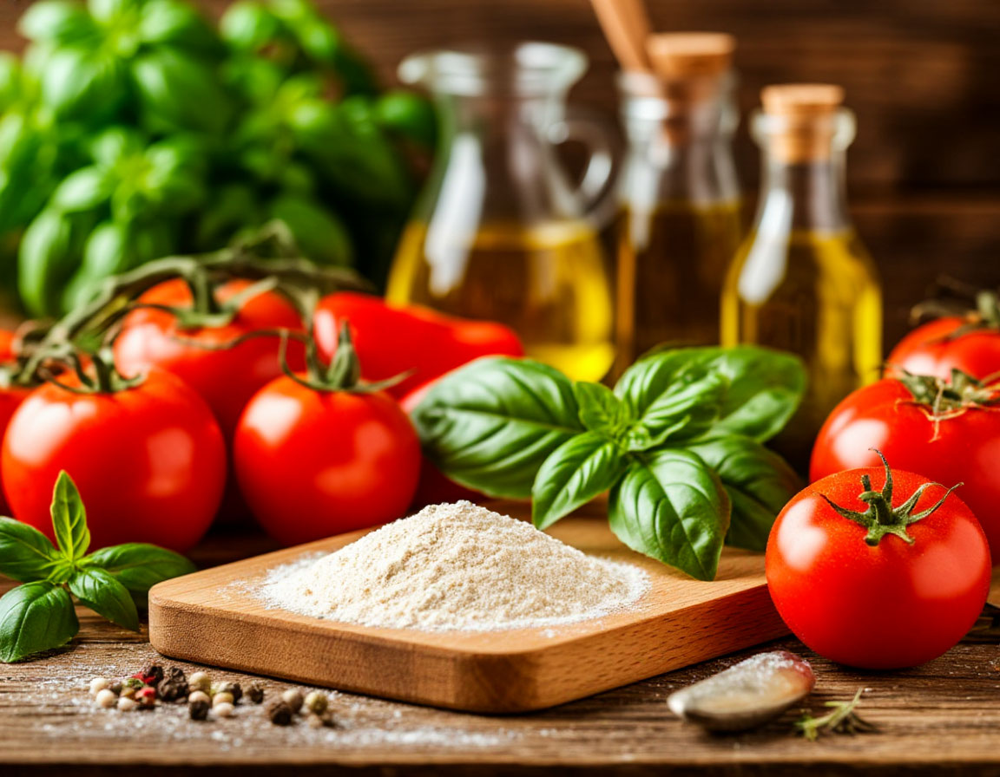

# 🍽️ Popular Recipes - Кулинарный сайт с рецептами

Адаптивный веб-сайт с коллекцией вкусных рецептов. Современный дизайн, полная адаптивность для всех устройств, интерактивные модальные окна и удобная навигация по категориям. Идеальный проект для портфолио frontend-разработчика.

## ✨ Особенности

- 📱 **Полная адаптивность** - идеальное отображение на всех устройствах
- 🎨 **Современный дизайн** - чистый UI с плавными анимациями
- 🔍 **Поиск рецептов** - мгновенный поиск по названию, ингредиентам и категориям
- 📂 **Категории** - удобная фильтрация по типам блюд
- 📖 **Детальные рецепты** - модальные окна с полной информацией
- ⚡ **Интерактивность** - плавные переходы и интуитивный интерфейс
- 🖨️ **Печать рецептов** - функция печати и分享 рецептов

## 🚀 Демо

[Посмотреть живую демонстрацию](https://your-username.github.io/popular-recipes)

## 🛠️ Технологии

- **HTML5** - Семантическая разметка
- **CSS3** - Grid, Flexbox, CSS Variables, анимации
- **Vanilla JavaScript** - ES6+ модули
- **Font Awesome** - Иконки
- **Google Fonts** - Шрифты Montserrat и Playfair Display

## 📁 Структура проекта
popular-recipes/
│
├── index.html # Главная страница
├── style.css # Основные стили
├── script.js # JavaScript логика
├── media/ # Папка с изображениями
│ ├── hero-bg.jpg
│ ├── recipe1.jpg
│ └── ...
└── README.md

## 🎯 Функциональность

### Основные возможности
- **20+ разнообразных рецептов** с полным описанием
- **4 категории**: Основные блюда, Десерты, Напитки, Вегетарианские
- **Поиск по сайту** - мгновенный поиск по всем рецептам
- **Модальные окна** - детальная информация о рецептах
- **Адаптивное меню** - гамбургер-меню для мобильных устройств

### Навигация
- Плавная прокрутка к секциям
- Активная навигация при скролле
- Фильтрация рецептов по категориям
- Кнопка "Загрузить еще" для постраничной загрузки

## 🖥️ Установка и запуск

1. **Клонируйте репозиторий**
   git clone https://github.com/your-username/popular-recipes.git
2. **Перейдите в директорию проекта**
   cd popular-recipes
3. **Запустите локальный сервер**
  # Используя Python
  python -m http.server 8000
  # Или используя Node.js
  npx http-server
4. **Откройте в браузере**
  http://localhost:8000

## 📱 Адаптивность
Сайт полностью адаптирован для:
💻 Десктопы (1200px+)
📱 Планшеты (768px - 1199px)
📱 Мобильные устройства (320px - 767px)

## 🤝 Вклад в проект
Форкните репозиторий
Создайте ветку для фичи (git checkout -b feature/AmazingFeature)
Закоммитьте изменения (git commit -m 'Add some AmazingFeature')
Запушьте в ветку (git push origin feature/AmazingFeature)
Откройте Pull Request

## 📄 Лицензия
Этот проект распространяется под лицензией MIT.

## 👨‍💻 Автор
Надежда Шкодина
GitHub: @Shtoga
Portfolio: [Portfolio](https://github.com/Shtoga/Portfolio)
